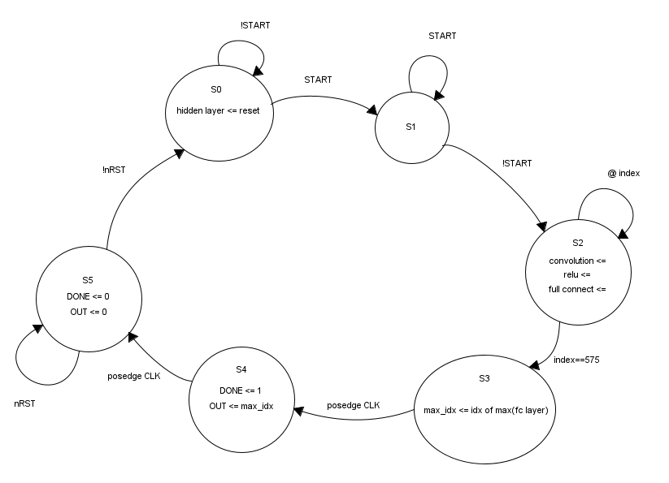
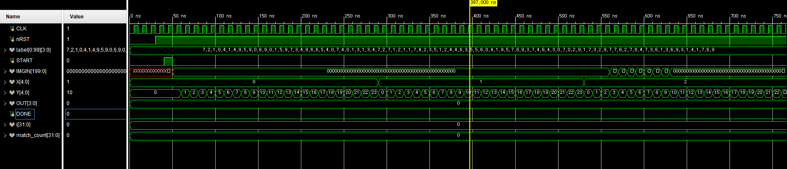
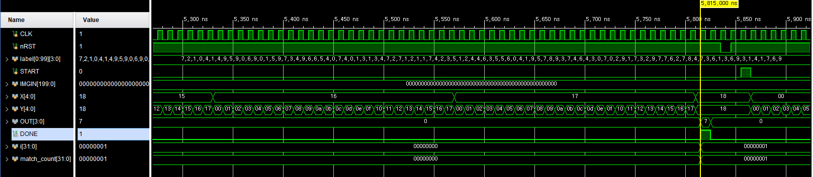

# CNN_HW_Accelerator
FPGA design that recognize MNIST dataset with CNN in HW level
## Logic
there's some c code that explain & simulate logic of HW

suppose serial input of 5*5 pixel(8bits/pixel) image data as IMGIN, X, Y indicates its position synced with CLK clock\
(START : start signal, nRST : reset signal)\
you can get 4 bits inference output as OUT which synced with DONE signal\
each data flow over CNN network, operates Convolution, ReLU, Full Connect operation
## Verilog Simulation (stimulus.v)

